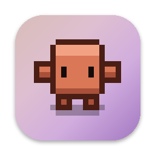
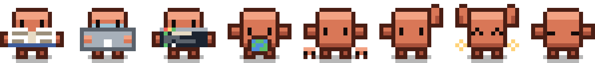
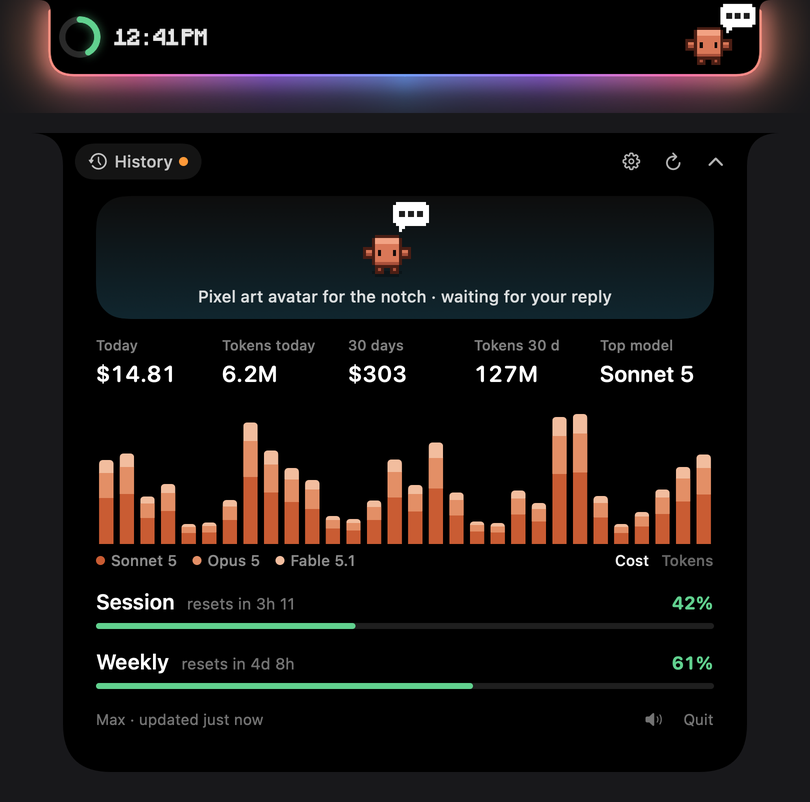

<p align="center"></p>

<h1 align="center">Clawdio</h1>

<p align="center">
  <a href="https://github.com/NoahSmo/clawdio/releases/latest"></a>
  
  
  <a href="LICENSE"></a>
</p>

<p align="center">Your Claude Code quota and agent status, right in the Mac notch — with a pixel art Clawd acting out whatever Claude is doing.</p>

<p align="center"></p>

<p align="center"></p>

<p align="center"><sub>Screenshot with sample data.</sub></p>

---

## Install

```bash
brew install --cask NoahSmo/clawdio/clawdio
```

Clawdio lands in `/Applications` — open it from Launchpad, Spotlight or `open -a Clawdio`.

| | |
|---|---|
| Update | `brew upgrade --cask clawdio` |
| Uninstall | `brew uninstall --cask clawdio` (add `--zap` to remove preferences too) |

**Requirements**: macOS 14 Sonoma or later (Liquid Glass needs macOS 26), and [Claude Code](https://docs.claude.com/en/docs/claude-code) installed and logged in (`claude`).

**First launch**: macOS asks for Keychain access to read the Claude Code token → choose **Always Allow**.
The app is ad-hoc signed and not notarized by Apple: the cask strips the quarantine attribute so Gatekeeper lets it open, and the Keychain prompt comes back after each update.

## What it shows

**In the notch**, at rest:
- on the left, a colored ring (5-hour session quota, green → orange → red) and the time it resets;
- on the right, Clawd and a badge for what the agent needs: sparkle = working · “…” bubble = it replied · orange “!” bubble = permission or question needed;
- a **halo** (tan → lavender → violet) outlines the pill while an agent is waiting for you (can be turned off);
- a **sound** when an agent finishes (Glass) or asks for permission (Funk).

**On click**, the panel opens: session and weekly quotas, cost and tokens for today and the last 30 days, per-day bars stacked by model (Cost / Tokens toggle), and your **conversation history** (list, then a live message thread). Click outside, hit the chevron or press Escape to close.

**No notch?** A simulated pill sits flush against the menu bar.

### Clawd

A 16 × 16 pixel character, seen from above, reacting to the most urgent agent among your recent sessions:

| Situation | Clawd |
|---|---|
| reading files (`Read`, `Grep`, `Glob`) | reads a book, eyes tracking the lines |
| editing files (`Edit`, `Write`) | types on a laptop, face lit by the screen |
| running a command (`Bash`) | types in a Terminal window |
| searching the web (`WebFetch`, `WebSearch`, browser MCP) | spins a globe |
| delegating to subagents (`Task`, `Agent`) | summons mini Clawds |
| thinking or writing its answer | looks up, taps a foot |
| replied, waiting for you | waves, sometimes jumps for joy |
| waiting for permission | raises a hand, hops |
| nothing going on | blinks, looks around, yawns… and falls asleep after 3 minutes (hover wakes him) |

Hovering makes him hop. With **Reduce Motion** (System Settings › Accessibility) he holds his poses and nothing animates.
Rendering is paused at rest: animations only cost CPU while they play.

### Settings

From the gear in the panel: clock font (Minecraft / System / Mono), sound, launch at login, notch halo, panel background (Glass / Black), hover reaction (Still / Subtle / Bouncy), and language (Auto / English / Français / Español / Deutsch — “Auto” follows the Mac language, falling back to English).

## Data and privacy

Everything stays local except **one** network call:

- **Quota**: the Claude Code OAuth token is read from the Keychain (`Claude Code-credentials`), then `GET api.anthropic.com/api/oauth/usage` every 60 s. Read-only: Clawdio never refreshes the token (that would sign Claude Code out); if it expired, run `claude`. The token is never stored or logged.
- **Cost and tokens**: computed from local transcripts in `~/.claude/projects/**/*.jsonl` (30 days, deduplicated). Cost is an **estimate at API rates** (`Data/Pricing.swift`), not your subscription bill; unknown models are flagged (“partial cost”).
- **Agent status and current tool**: inferred from the tail of those transcripts, with nothing to configure in Claude Code. “Permission needed” is a heuristic (permission-gated tool, transcript idle for more than 15 s, mode neither auto nor bypass), so a long command can trigger it by mistake.

Transcript contents are never sent or copied anywhere. Only settings and the last quota values (percentages, reset times) are persisted, in macOS preferences.

## Development

Plain Swift (AppKit + SwiftUI), a Swift package with no Xcode project.

```bash
swift build && .build/debug/Clawdio   # run from source
./scripts/install-cask.sh             # install the local build into /Applications (local tap "local/clawdio")
./scripts/build-app.sh                # just the bundle: build/Clawdio.app
```

`install-cask.sh` and the published cask share one name: uninstall one before installing the other.
To stop the Keychain prompt on every build: `SIGN_IDENTITY="Apple Development: …" ./scripts/install-cask.sh`.

**Debug tools** (debug builds only):
- `.build/debug/Clawdio --snapshot <dir>` renders every state to PNG (pill, panel, languages, each Clawd activity) plus `avatar-sheet.png`, a contact sheet of all clips — no screen-recording permission needed;
- `./scripts/sprite-viewer.sh` builds `build/sprite-viewer.html`, a bench to step through the animations frame by frame;
- `CLAWDIO_AUTOOPEN=1 CLAWDIO_TRACE=1 .build/release/Clawdio` opens the panel after 1.5 s and traces its animation into `/tmp/clawdio_trace.log` and `/tmp/clawdio_frames/` (`CLAWDIO_TRACE=cold` simulates a click with no prior hover).

**Icon and README images**: `./scripts/make-icon.sh`, `./scripts/make-screenshot.sh` and `./scripts/make-social.sh` (the repo's social preview card) regenerate them from the real sprites and from sample data (Pillow required) — no real quota, cost or conversation ever ships in a screenshot.

**Publish a release** (`gh` logged in, clean working tree):

```bash
./scripts/release.sh 0.2.0   # tag, GitHub Release with the zip, cask updated in NoahSmo/homebrew-clawdio
```

**Add a language**: one table in `Settings/Localization.swift` (a missing key falls back to English, then French).

### Layout

| Path (`Sources/Clawdio/`) | Role |
|---|---|
| `Data/ClaudeCredentials.swift`, `UsageAPI.swift`, `UsageModel.swift` | quota: Keychain, request, refresh loop |
| `Data/LocalUsage.swift`, `LocalUsageStore.swift`, `Pricing.swift` | transcript scanning, per-day and per-model totals, rates |
| `Sessions/SessionScanner.swift`, `SessionStore.swift` | agent status, current tool, history, sounds |
| `Settings/` | preferences, languages, bundled font |
| `Notch/` | notch geometry, window, hover and click, animated shape |
| `UI/NotchRootView.swift` | pill, header and panel pages |
| `UI/StatsSection.swift`, `HistoryViews.swift`, `SettingsPage.swift` | stats, history, settings |
| `UI/PanelBackground.swift`, `UsageLevel.swift` | glass and gradients, color thresholds |
| `UI/Avatar/PixelArt.swift`, `SpriteClip.swift`, `AvatarPalette.swift` | text-described sprites → images, frame-by-frame clips, colors |
| `UI/Avatar/AvatarView.swift`, `AvatarDirector.swift` | rendering, and what Clawd plays when |
| `UI/Avatar/AvatarMood.swift`, `AvatarActivity.swift` | mood from agent status, activity from the tool in use |
| `UI/Avatar/Sprites/` | the drawings: base, activities, idle, badges |
| `UI/StatusBadge.swift` | the need badge next to Clawd |
| `Debug/` | `--snapshot` captures, sprite export, sample data, traces |

**Window**: always the size of the panel, transparent and click-through except over the pill or the open panel, and never resized. A single animated shape (`MorphShape`) is the background, the mask and the halo path, with one spring driving size, position and corner radii.

## License and credits

Code under the [MIT license](LICENSE).
Font: [Monocraft](https://github.com/IdreesInc/Monocraft) (SIL Open Font License, license in `Resources/Fonts/`), a free recreation of the Minecraft style.

Independent project, not affiliated with Anthropic. Claude and Claude Code are trademarks of Anthropic.
