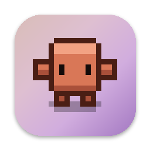
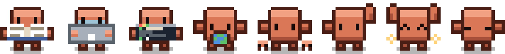
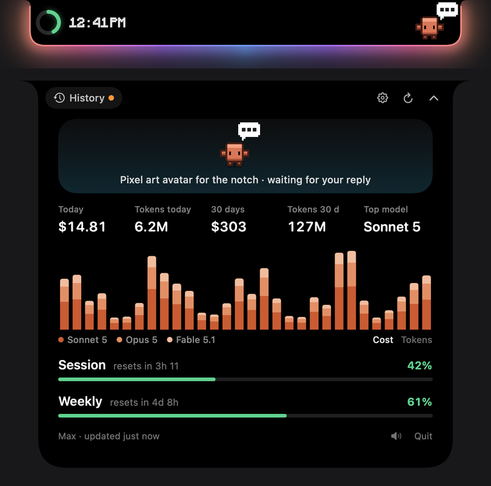
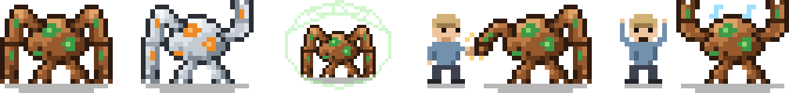

<p align="center"></p>

<h1 align="center">Clawdio</h1>

<p align="center">
  <a href="https://github.com/NoahSmo/clawdio/releases/latest"></a>
  
  
  <a href="LICENSE"></a>
</p>

<p align="center">Your Claude Code quota and agent status, right in the Mac notch — with a pixel art Clawd (or Rocky, from <i>Project Hail Mary</i>) acting out whatever Claude is doing.</p>

<p align="center"></p>

<p align="center"></p>

<p align="center"><sub>Screenshot with sample data.</sub></p>

---

## Install

```bash
brew install --cask NoahSmo/tap/clawdio
```

Clawdio lands in `/Applications` — open it from Launchpad, Spotlight or `open -a Clawdio`.

| | |
|---|---|
| Update | `brew upgrade --cask clawdio` |
| Uninstall | `brew uninstall --cask clawdio` (add `--zap` to remove preferences too) |

**Requirements**: macOS 14 Sonoma or later (Liquid Glass needs macOS 26), and [Claude Code](https://docs.claude.com/en/docs/claude-code) installed and logged in (`claude`).

**First launch**: macOS asks for Keychain access to read the Claude Code token → choose **Always Allow**.
The app is ad-hoc signed and not notarized by Apple: the cask strips the quarantine attribute so Gatekeeper lets it open, and the Keychain prompt comes back after each update.

## What it shows

**In the notch**, at rest:
- on the left, a colored ring (5-hour session quota, green → orange → red) and the time it resets;
- on the right, the avatar (Clawd by default) and a badge for what the agent needs: sparkle = working · “…” bubble = it replied · orange “!” bubble = permission or question needed;
- a **halo** (tan → lavender → violet) outlines the pill while an agent is waiting for you (can be turned off);
- a **sound** when an agent finishes (Glass) or asks for permission (Funk).

**On click**, the panel opens: session and weekly quotas, cost and tokens for today and the last 30 days, per-day bars stacked by model (Cost / Tokens toggle), and your **conversation history** (list, then a live message thread). Click outside, hit the chevron or press Escape to close.

**No notch?** A simulated pill sits flush against the menu bar.

### Clawd

A 16 × 16 pixel character, seen from above, reacting to the most urgent agent among your recent sessions:

| Situation | Clawd |
|---|---|
| reading files (`Read`, `Grep`, `Glob`) | reads a book, eyes tracking the lines |
| editing files (`Edit`, `Write`) | types on a laptop, face lit by the screen |
| running a command (`Bash`) | types in a Terminal window |
| searching the web (`WebFetch`, `WebSearch`, browser MCP) | spins a globe |
| delegating to subagents (`Task`, `Agent`) | summons mini Clawds |
| thinking or writing its answer | looks up, taps a foot |
| replied, waiting for you | jumps for joy once, then waves now and then |
| waiting for permission | raises a hand, hops (quickly at first, then spaced out) |
| nothing going on | blinks, looks around, yawns… and falls asleep after 3 minutes (hover wakes him) |

Hovering makes him hop. With **Reduce Motion** (System Settings › Accessibility) he holds his poses and nothing animates.
Rendering is paused at rest: animations only cost CPU while they play.

### Rocky

<p align="center"></p>

Prefer an Eridian? Pick another **character** in Settings. Rocky, the rock-shelled engineer from Andy Weir's *Project Hail Mary*, plays the same situations as Clawd, in his own way:

- he has no eyes, so he doesn't blink or look around. He taps a foot, hums (musical notes are his voice) and plays chords. When he reads, a sonar dot sweeps the lines of the book;
- five thick, segmented legs: he waves with a claw, holds the book or the Terminal between two claws and summons mini-Rockys to delegate;
- when he's tired, his carapace sags before he falls asleep.

| Character | |
|---|---|
| **Rocky** | copper rock carapace with green patina |
| **Rocky EVA** | same, in his white spacesuit with orange patches |
| **Rocky bulle** | inside the green geodesic dome where he lives aboard the *Hail Mary* |
| **Rocky & Grace** | Rocky with Ryland Grace at his side, quoting the film |

**Rocky & Grace** is the talkative one. Grace blinks and glances at Rocky, they fist-bump, and when it's time to sleep it's Grace who dozes off while Rocky watches over him. In the panel, their lines pop up in a speech bubble:

| When | Line |
|---|---|
| Claude is done and waiting for you | “Amaze! Amaze! Amaze!” (Grace cheers too) |
| Claude needs permission | “Question?” |
| they fist-bump (at rest) | “Fist my bump.” |
| Rocky plays a chord (at rest) | “Happy happy happy!” |
| Grace falls asleep | “You sleep. I watch.” |

The duo is twice as wide as Clawd, so in the notch it's drawn at a smaller scale to fit inside the pill.

### Settings

From the gear in the panel: avatar character (Clawd / Rocky / Rocky EVA / Rocky bulle / Rocky & Grace), clock font (Minecraft / System / Mono), sound, launch at login, notch halo, panel background (Glass / Black), hover reaction (Still / Subtle / Bouncy), and language (Auto / English / Français / Español / Deutsch — “Auto” follows the Mac language, falling back to English).

## Data and privacy

Everything stays local except **one** network call:

- **Quota**: the Claude Code OAuth token is read from the Keychain (`Claude Code-credentials`), then `GET api.anthropic.com/api/oauth/usage` every 60 s. Read-only: Clawdio never refreshes the token (that would sign Claude Code out); if it expired, run `claude`. The token is never stored or logged.
- **Cost and tokens**: computed from local transcripts in `~/.claude/projects/**/*.jsonl` (30 days, deduplicated). Cost is an **estimate at API rates** (`Data/Pricing.swift`), not your subscription bill; unknown models are flagged (“partial cost”).
- **Agent status and current tool**: inferred from the tail of those transcripts, with nothing to configure in Claude Code. “Permission needed” is a heuristic (permission-gated tool, transcript idle for more than 15 s, mode neither auto nor bypass), so a long command can trigger it by mistake.

Transcript contents are never sent or copied anywhere. Only settings and the last quota values (percentages, reset times) are persisted, in macOS preferences.

## Development

Plain Swift (AppKit + SwiftUI), a Swift package with no Xcode project.

```bash
swift build && .build/debug/Clawdio   # run from source
./scripts/install-cask.sh             # install the local build into /Applications (local tap "local/clawdio")
./scripts/build-app.sh                # just the bundle: build/Clawdio.app
```

`install-cask.sh` and the published cask share one name: uninstall one before installing the other.
To stop the Keychain prompt on every build: `SIGN_IDENTITY="Apple Development: …" ./scripts/install-cask.sh`.

**Debug tools** (debug builds only):
- `.build/debug/Clawdio --snapshot <dir>` renders every state to PNG (pill, panel, languages, each activity) plus `avatar-sheet-<character>.png`, a contact sheet of every clip for each character — no screen-recording permission needed. The pill uses the character from your debug preferences; override it with `-clawdio.avatar rockyGrace`;
- `./scripts/sprite-viewer.sh [out.html] [character]` builds `build/sprite-viewer.html`, a bench to step through a character's animations frame by frame (`clawd` by default; `rocky`, `rockySuit`, `rockyBubble`, `rockyGrace`);
- `CLAWDIO_AUTOOPEN=1 CLAWDIO_TRACE=1 .build/release/Clawdio` opens the panel after 1.5 s and traces its animation into `/tmp/clawdio_trace.log` and `/tmp/clawdio_frames/` (`CLAWDIO_TRACE=cold` simulates a click with no prior hover).

**Icon and README images**: `./scripts/make-icon.sh` (also writes `docs/avatar.png`), `./scripts/make-characters.sh` (`docs/characters.png`), `./scripts/make-screenshot.sh` and `./scripts/make-social.sh` (the repo's social preview card) regenerate them from the real sprites and from sample data (Pillow required) — no real quota, cost or conversation ever ships in a screenshot.

**Publish a release** (`gh` logged in, clean working tree):

```bash
./scripts/release.sh 0.3.0   # tag, GitHub Release with the zip, cask updated in NoahSmo/homebrew-tap
```

**Add a language**: one table in `Settings/Localization.swift` (a missing key falls back to English, then French).

### Custom characters and sprites

There are no image files. Every sprite is a **text grid** in Swift, one character per pixel, `.` for transparent. The grids are turned into images once at launch. They read fine in a diff and you can draw them in any editor.

```swift
static let body = PixelGrid(at: 8, [   // lines laid from row 8 of a 16 × 16 canvas, the rest is transparent
    "......KKKK......",
    "....KKGGGGKK....",
    "...KGGEGGEGGK...",
], palette: ["K": PixelColor(0x1B3A2A), "G": PixelColor(0x5CBF6A), "E": PixelColor(0x140B0A)])
```

The building blocks, all in `UI/Avatar/`:

| Type | What it is |
|---|---|
| `PixelGrid` | a text grid and its palette. `PixelGrid.layered([...])` stacks layers (body + arm + prop), `placed(width:height:dx:dy:)` moves a layer onto a bigger canvas |
| `SpriteFrame` | one image, plus an offset (`dx`, `dy`, used for hops) and how many ticks it's held (`hold`) |
| `SpriteClip` | frames played at a fixed `fps`, with an optional `quote` (speech bubble, shown in the panel) |
| `AvatarRepertoire` | everything a character can play: rest pose per mood, one clip per activity, the general clips (hop, wave, cheer, raise hand, sleep…) and weighted idle gestures |
| `AvatarCharacter` | the list shown in Settings. Each case returns its repertoire |

**Add a character** in three steps:

1. **Draw it** in a new file under `UI/Avatar/Sprites/`: a palette, a few layers, frames and clips. `Rocky.swift` is the complete example: 24 × 20 canvas, layers per leg, outfits as palette swaps, Clawd's props (book, laptop, Terminal, globe) reused and recolored.
2. **Build its repertoire.** The smallest possible one reuses a single clip everywhere:

   ```swift
   extension AvatarRepertoire {
       static let blob = AvatarRepertoire(
           width: 16, height: 16,
           shadow: BlobSprites.shadow,
           stand: BlobSprites.stand,
           sleeping: BlobSprites.blinking,
           rest: { _ in BlobSprites.stand },            // pose held per mood (per activity while working)
           activityClip: { _ in BlobSprites.hop },      // clip replayed while reading, coding, running…
           hop: BlobSprites.hop, wave: BlobSprites.hop, cheer: BlobSprites.hop,
           raiseHand: BlobSprites.hop, push: BlobSprites.hop,
           fallAsleep: BlobSprites.blink, snore: BlobSprites.blink, wake: BlobSprites.hop,
           idle: [(BlobSprites.blink, 1, 1)]            // (clip, weight, weight once drowsy)
       )
   }
   ```

3. **Register it**: add a case to `AvatarCharacter` with its `name` and `repertoire`. It shows up in Settings with a preview. `AvatarDirector` decides *when* to play each clip, the same way for every character.

Then check it frame by frame with `./scripts/sprite-viewer.sh out.html <case>` and in context with `--snapshot`.

Tips that came out of drawing Clawd and Rocky:
- **The notch is tiny.** Keep animations calm: move one small thing (eyes, one claw), not whole limbs every frame.
- **Props must read at 16 px.** Hold them facing the viewer and make them wider than the body. Pick literal objects: a Terminal window for `Bash`, a book for `Read`.
- **Canvas size is free.** Clawd is 16 × 16, Rocky 24 × 20, the duo 36 × 20. Keep the top rows empty for hops and raised arms. `pixelScale` gives a character finer pixels (Rocky's bubble uses ⅔), and the notch steps the scale down by half-points until the avatar fits (`AvatarRepertoire.fitting`).
- **Two dark spots side by side read as eyes.** Offset texture spots on an eyeless character.

### Layout

| Path (`Sources/Clawdio/`) | Role |
|---|---|
| `Data/ClaudeCredentials.swift`, `UsageAPI.swift`, `UsageModel.swift` | quota: Keychain, request, refresh loop |
| `Data/LocalUsage.swift`, `LocalUsageStore.swift`, `Pricing.swift` | transcript scanning, per-day and per-model totals, rates |
| `Sessions/SessionScanner.swift`, `SessionStore.swift` | agent status, current tool, history, sounds |
| `Settings/` | preferences, languages, bundled font |
| `Notch/` | notch geometry, window, hover and click, animated shape |
| `UI/NotchRootView.swift` | pill, header and panel pages |
| `UI/StatsSection.swift`, `HistoryViews.swift`, `SettingsPage.swift` | stats, history, settings |
| `UI/PanelBackground.swift`, `UsageLevel.swift` | glass and gradients, color thresholds |
| `UI/Avatar/PixelArt.swift`, `SpriteClip.swift`, `AvatarPalette.swift` | text-described sprites → images, frame-by-frame clips, colors |
| `UI/Avatar/AvatarView.swift`, `AvatarDirector.swift` | rendering and speech bubbles, and what the avatar plays when |
| `UI/Avatar/AvatarCharacter.swift` | the selectable characters and their repertoires |
| `UI/Avatar/AvatarMood.swift`, `AvatarActivity.swift` | mood from agent status, activity from the tool in use |
| `UI/Avatar/Sprites/` | the drawings: Clawd (base, activities, idle), Rocky and Grace (`Rocky.swift`), badges |
| `UI/StatusBadge.swift` | the need badge next to the avatar |
| `Debug/` | `--snapshot` captures, sprite export, sample data, traces |

**Window**: always the size of the panel, transparent and click-through except over the pill or the open panel, and never resized. A single animated shape (`MorphShape`) is the background, the mask and the halo path, with one spring driving size, position and corner radii.

## License and credits

Code under the [MIT license](LICENSE).
Font: [Monocraft](https://github.com/IdreesInc/Monocraft) (SIL Open Font License, license in `Resources/Fonts/`), a free recreation of the Minecraft style.

Independent project, not affiliated with Anthropic. Claude and Claude Code are trademarks of Anthropic.
Rocky and Ryland Grace are characters from Andy Weir's novel *Project Hail Mary* and its film adaptation. This fan tribute is not affiliated with the author or the studio.
